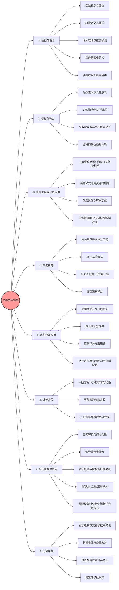

> 考研学习计划

> 更多的学习计划在 : https://read.likui.space/learn/ 

## 高等数学

```mermaid

graph LR
    %% 全章节详细思维导图
    Class((高等数学体系)) --> Ch1[1. 函数与极限]
    Class --> Ch2[2. 导数与微分]
    Class --> Ch3[3. 中值定理与导数应用]
    Class --> Ch4[4. 不定积分]
    Class --> Ch5[5. 定积分及应用]
    Class --> Ch6[6. 微分方程]
    Class --> Ch7[7. 多元函数微积分]
    Class --> Ch8[8. 无穷级数]

    %% 章节1分支
    Ch1 --> Ch1_1[函数概念与四性]
    Ch1 --> Ch1_2[极限定义与性质]
    Ch1 --> Ch1_3[两大准则与重要极限]
    Ch1 --> Ch1_4[等价无穷小替换]
    Ch1 --> Ch1_5[连续性与间断点分类]

    %% 章节2分支
    Ch2 --> Ch2_1[导数定义与几何意义]
    Ch2 --> Ch2_2[复合/隐/参数方程求导]
    Ch2 --> Ch2_3[高数阶导数与莱布尼茨公式]
    Ch2 --> Ch2_4[微分的线性逼近本质]

    %% 章节3分支
    Ch3 --> Ch3_1[三大中值定理: 罗尔/拉格朗日/柯西]
    Ch3 --> Ch3_2[泰勒公式与麦克劳林展开]
    Ch3 --> Ch3_3[洛必达法则解未定式]
    Ch3 --> Ch3_4[单调性/极值/凹凸性/拐点/渐近线]

    %% 章节4分支
    Ch4 --> Ch4_1[原函数与基本积分公式]
    Ch4 --> Ch4_2[第一/二换元法]
    Ch4 --> Ch4_3[分部积分法: 反对幂三指]
    Ch4 --> Ch4_4[有理函数积分]

    %% 章节5分支
    Ch5 --> Ch5_1[定积分定义与几何意义]
    Ch5 --> Ch5_2[变上限积分求导]
    Ch5 --> Ch5_3[反常积分与瑕积分]
    Ch5 --> Ch5_4[微元法应用: 面积/体积/物理做功]

    %% 章节6分支
    Ch6 --> Ch6_1[一阶方程: 可分离/齐次/线性]
    Ch6 --> Ch6_2[可降阶的高阶方程]
    Ch6 --> Ch6_3[二阶常系数线性微分方程]

    %% 章节7分支
    Ch7 --> Ch7_1[空间解析几何与向量]
    Ch7 --> Ch7_2[偏导数与全微分]
    Ch7 --> Ch7_3[多元极值与拉格朗日乘数法]
    Ch7 --> Ch7_4[重积分: 二重/三重积分]
    Ch7 --> Ch7_5[线面积分: 格林/高斯/斯托克斯公式]

    %% 章节8分支
    Ch8 --> Ch8_1[正项级数与交错级数审敛法]
    Ch8 --> Ch8_2[绝对收敛与条件收敛]
    Ch8 --> Ch8_3[幂级数收敛半径与展开]
    Ch8 --> Ch8_4[傅里叶级数展开]

    %% 样式微调
    style Class fill:#ff9999,stroke:#333,stroke-width:2px


```

## 第一章 函数与极限

```mermaid
graph TD
    %% 函数与极限深度拆解导图
    Ch1((第一章: 函数与极限)) --> Func[1. 函数与映射]
    Ch1 --> Limit_Base[2. 极限概念与性质]
    Ch1 --> Limit_Calc[3. 极限计算方法]
    Ch1 --> Inf[4. 无穷小与无穷大]
    Ch1 --> Cont[5. 连续性与间断点]

    %% 1. 函数分支
    Func --> Func_1[定义域/值域/复合与反函数]
    Func --> Func_2[四性判定]
    Func_2 --> F_单调[单调性: 导数正负]
    Func_2 --> F_奇偶[奇偶性: 负x与正x函数值关系]
    Func_2 --> F_周期[周期性: 加T后函数值不改变]
    Func_2 --> F_有界[有界性: 绝对值存在上界M]

    %% 2. 极限概念分支
    Limit_Base --> L_Def[数列极限定义 / 函数极限定义]
    Limit_Base --> L_Prop[基本性质]
    L_Prop --> LP_1[唯一性: 极限存在必唯一]
    L_Prop --> LP_2[局部有界性]
    L_Prop --> LP_3[局部保号性: 极其重要考点]
    L_Prop --> LP_4[充要条件: 左极限等于右极限]

    %% 3. 极限计算分支
    Limit_Calc --> LC_Rule[四则运算法则: 分母不为0]
    Limit_Calc --> LC_Principle[两大存在准则]
    LC_Principle --> LCP_1[夹逼准则: 适用于n项和极限]
    LC_Principle --> LCP_2[单调有界准则: 适用于递推数列]
    Limit_Calc --> LC_Important[两个重要极限]
    LC_Important --> LCI_1["公式1: sinx与x的比值趋近于1"]
    LC_Important --> LCI_2["公式2: 1加倒数x的x次方趋近于e"]
    Limit_Calc --> LC_Tools[进阶工具]
    LC_Tools --> LCT_1[洛必达法则: 0比0或无穷比无穷未定式]
    LC_Tools --> LCT_2[泰勒公式展开: 精准且降维打击]

    %% 4. 无穷小分支
    Inf --> I_Compare[无穷小阶的比较]
    I_Compare --> IC_1[高阶/低阶/同阶/k阶无穷小]
    I_Compare --> IC_2[等价无穷小: 比值的极限等于1]
    Inf --> I_Replace[常用等价替换]
    I_Replace --> IR_1["基础项: sinx ~ tanx ~ arcsinx ~ arctanx ~ x"]
    I_Replace --> IR_2["对数指数: lnx加1 ~ ex减1 ~ x"]
    I_Replace --> IR_3["余弦与根式: 1减cosx ~ 0.5x方"]

    %% 5. 连续与间断分支
    Cont --> C_Def[连续定义: 左右极限等于函数值]
    Cont --> C_Point[间断点分类: 找未定义点或分段点]
    C_Point --> CP_1[第一类间断点: 左右极限均存在]
    CP_1 --> CP_1_1[可去间断点: 左右极限相等但不等于函数值]
    CP_1 --> CP_1_2[跳跃间断点: 左右极限不相等]
    C_Point --> CP_2[第二类间断点: 左右极限至少一个不存在]
    CP_2 --> CP_2_1[无穷间断点: 趋近该点时函数值为无穷]
    CP_2 --> CP_2_2[振荡间断点: 趋近该点时函数值剧烈振荡]
    Cont --> C_Th[闭区间连续函数三大定理]
    C_Th --> CT_1[最值定理与有界性定理]
    C_Th --> CT_2[介值定理与两点间取值]
    C_Th --> CT_3[零点定理: 异号必有根]

    %% 样式美化
    style Ch1 fill:#f9f,stroke:#333,stroke-width:2px
    style Limit_Calc fill:#bbf,stroke:#333,stroke-width:2px
    style Inf fill:#bfb,stroke:#333,stroke-width:2px
    style Cont fill:#fbb,stroke:#333,stroke-width:2px


```